# tokokita

A new Flutter project.

## Getting Started

This project is a starting point for a Flutter application.

A few resources to get you started if this is your first Flutter project:

- [Lab: Write your first Flutter app](https://docs.flutter.dev/get-started/codelab)
- [Cookbook: Useful Flutter samples](https://docs.flutter.dev/cookbook)

For help getting started with Flutter development, view the
[online documentation](https://docs.flutter.dev/), which offers tutorials,
samples, guidance on mobile development, and a full API reference.

1. Proses Register
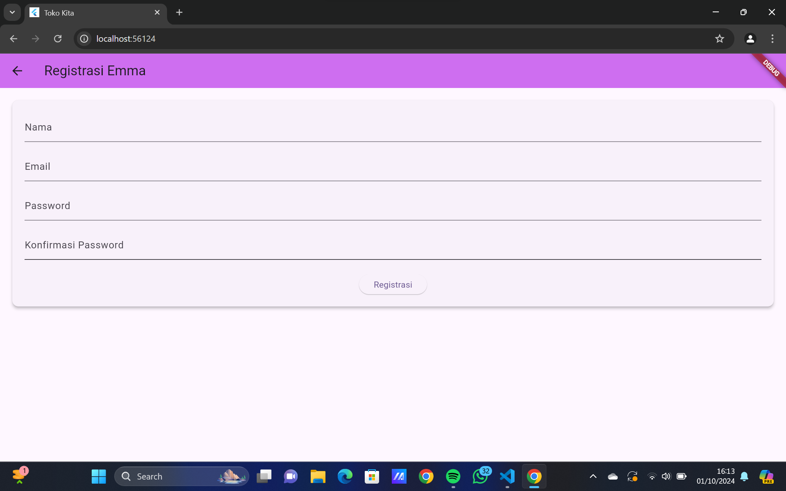
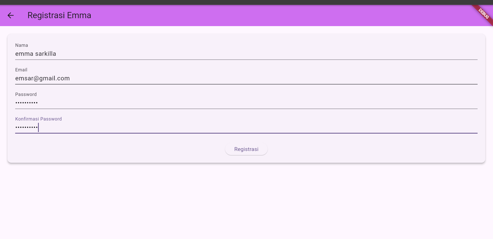
a. Form Registrasi
Formulir registrasi terdiri dari beberapa komponen input yang diatur menggunakan widget Form. Ada beberapa field yang harus diisi oleh pengguna:

Nama (_namaTextField): Pengguna memasukkan nama mereka di sini. Ada validasi bahwa nama harus diisi minimal 3 karakter.
Email (_emailTextField): Pengguna memasukkan email mereka. Validasi memastikan bahwa kolom email tidak kosong dan harus dalam format email yang valid.
Password (_passwordTextField): Pengguna memasukkan password mereka dengan minimal 6 karakter. Password ditampilkan dalam mode obscureText, artinya karakter yang dimasukkan disembunyikan.
Konfirmasi Password (_passwordKonfirmasiTextField): Pengguna memasukkan kembali password untuk memverifikasi kesamaan dengan password di atas. Jika tidak sama, validasi akan memberikan pesan kesalahan.
Setelah pengguna mengisi form, mereka menekan tombol Registrasi yang memanggil fungsi onPressed.

b. Proses Validasi dan Submit
Ketika tombol Registrasi ditekan, fungsi _buttonRegistrasi() dijalankan, yang akan melakukan validasi input form dengan perintah validate. Jika semua input valid:

Fungsi _submit() dipanggil untuk memproses registrasi.
Saat fungsi _submit() dipanggil:
Semua input disimpan (save()).
Status loading diatur menjadi true agar UI bisa menunjukkan proses sedang berlangsung.
Fungsi RegistrasiBloc.registrasi() dipanggil untuk melakukan registrasi ke backend atau database, dengan mengirimkan nama, email, dan password dari text input.
c. Pop-up Success atau Warning
Setelah fungsi RegistrasiBloc.registrasi() dijalankan, hasilnya menentukan pop-up yang ditampilkan:

Pop-up Success (SuccessDialog): Jika registrasi berhasil, pop-up SuccessDialog akan muncul, menampilkan pesan "Registrasi berhasil, silahkan login". Pengguna perlu menekan tombol "OK" untuk menutup pop-up. Fungsi okClick yang dipanggil setelah tombol ditekan akan menutup dialog dan kembali ke halaman sebelumnya.
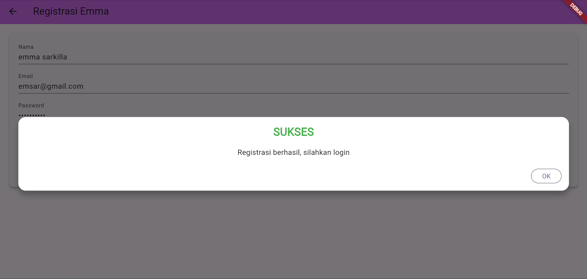
showDialog(
  context: context,
  barrierDismissible: false,
  builder: (BuildContext context) => SuccessDialog(
    description: "Registrasi berhasil, silahkan login",
    okClick: () {
      Navigator.pop(context); // menutup pop-up
    },
  )
);
Pop-up Warning (WarningDialog): Jika terjadi kesalahan selama registrasi, seperti koneksi gagal atau data tidak valid, pop-up WarningDialog akan muncul dengan pesan "Registrasi gagal, silahkan coba lagi". Pop-up ini juga akan mencegah pengguna untuk langsung keluar dari pop-up tanpa interaksi.
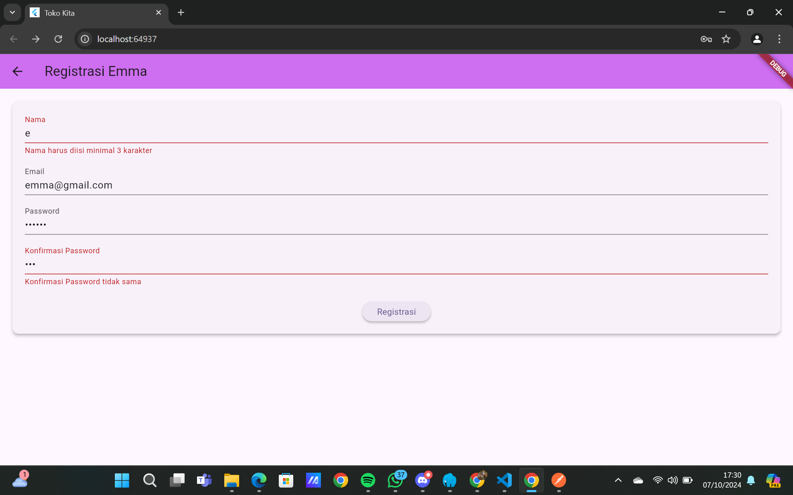

2. Proses Login
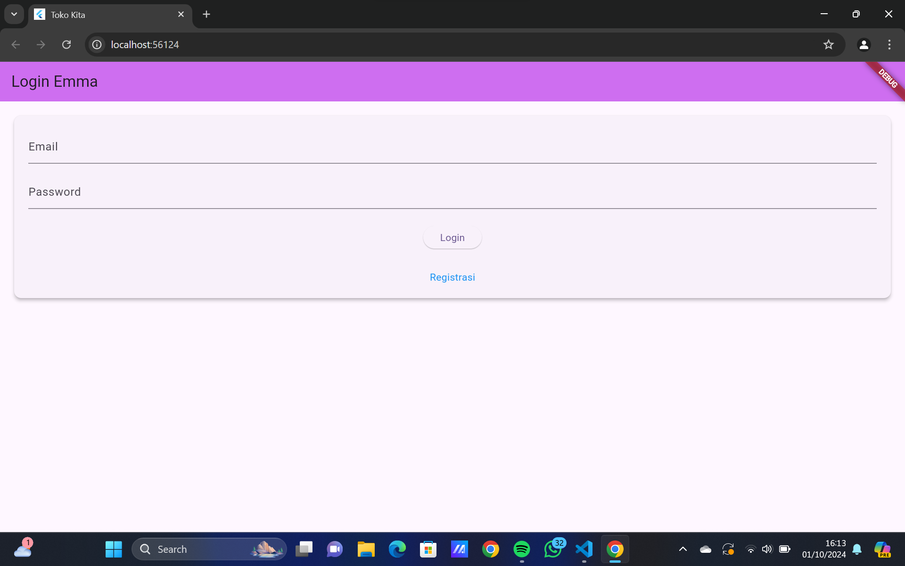
- State Management dan Form Validasi
LoginPage menggunakan StatefulWidget karena terdapat elemen yang perlu di-update, seperti status loading saat login. _formKey digunakan untuk mengelola validasi form, memastikan bahwa email dan password diisi dengan benar.

- Form Input
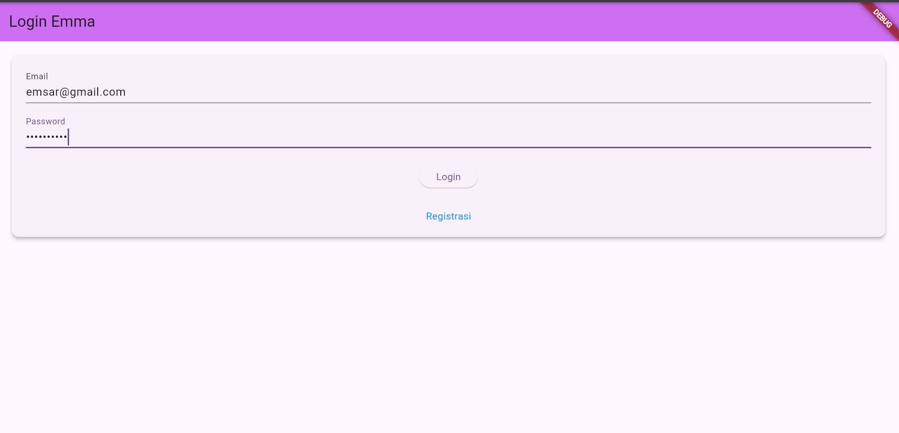
_emailTextField(): TextFormField yang digunakan untuk input email, divalidasi agar tidak kosong.
_passwordTextField(): TextFormField untuk input password yang disembunyikan (obscureText). Sama dengan email, input ini divalidasi agar tidak kosong dan memiliki minimal 6 karakter.
- Tombol Login
_buttonLogin(): Tombol yang digunakan untuk mengirim form. Ketika ditekan, form divalidasi. Jika valid, tombol akan memanggil fungsi _submit() untuk memproses login.
- _submit():
Fungsi ini memulai proses login. Setelah validasi berhasil, state diubah menjadi loading, dan data login dikirim ke LoginBloc untuk diproses.
Jika login berhasil (kode respons 200), token dan userID disimpan di perangkat menggunakan UserInfo(), lalu pengguna diarahkan ke halaman ProdukPage.
Jika gagal, dialog peringatan (WarningDialog) muncul yang memberi tahu bahwa login gagal.
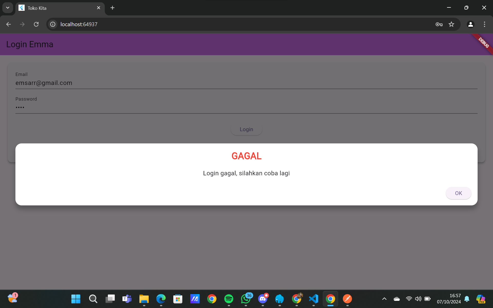
- _menuRegistrasi():
Ini adalah link yang mengarahkan pengguna ke halaman registrasi (RegistrasiPage) ketika teks "Registrasi" ditekan.

3. Proses Tambah Data dan Ubah Data Produk
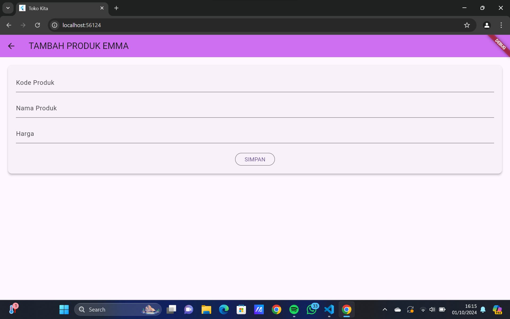
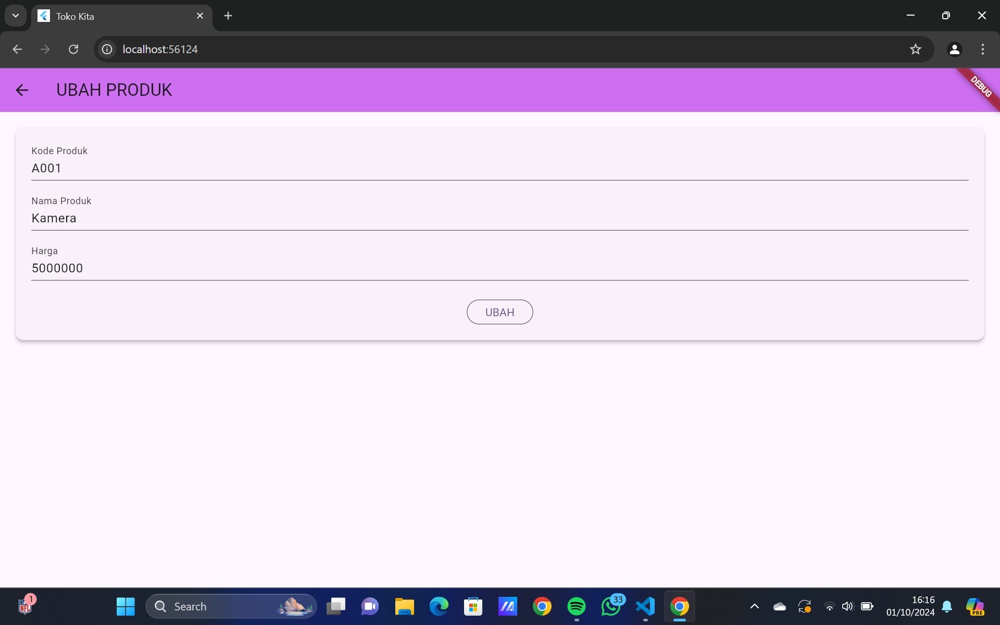

- ProdukForm Stateful Widget:
ProdukForm adalah sebuah widget yang digunakan untuk menampilkan formulir bagi pengguna untuk menambahkan atau mengedit data produk.
Widget ini menerima objek produk sebagai parameter opsional. Jika objek produk tersedia (tidak null), maka aplikasi akan berada dalam mode edit produk. Jika tidak ada produk yang diberikan (null), maka aplikasi berada dalam mode tambah produk.

- State Management - isUpdate():
Di dalam fungsi initState(), metode isUpdate() dipanggil untuk memeriksa apakah widget berada dalam mode tambah atau edit.
Jika ada data produk yang diterima (widget.produk != null), maka field di form akan diisi dengan nilai-nilai produk yang sudah ada dan label tombol diubah menjadi "UBAH". Judul form juga diubah menjadi "UBAH PRODUK".
Jika produk yang diterima adalah null, aplikasi berada dalam mode tambah, sehingga judulnya adalah "TAMBAH PRODUK EMMA" dan tombolnya bertuliskan "SIMPAN".

- TextFormField:
Form ini memiliki tiga field input:
Kode Produk: Diisi dengan kode unik produk.
Nama Produk: Diisi dengan nama produk.
Harga Produk: Diisi dengan harga produk dalam format angka.
Setiap field dilengkapi dengan validator untuk memastikan bahwa pengguna mengisi data yang diperlukan (misalnya, tidak boleh kosong).
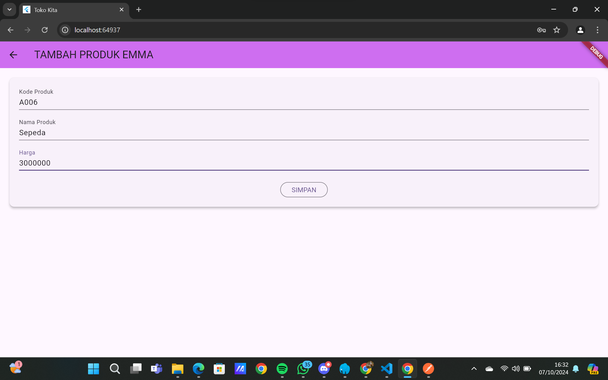

- Tombol Simpan/Ubah:
Tombol submit akan menampilkan teks sesuai dengan mode form (tambah atau ubah produk).
Ketika tombol ditekan, aplikasi akan memvalidasi data di form. Jika validasi berhasil:
Tambah Produk: Jika produk yang diberikan adalah null, maka produk baru akan dibuat menggunakan fungsi simpan().
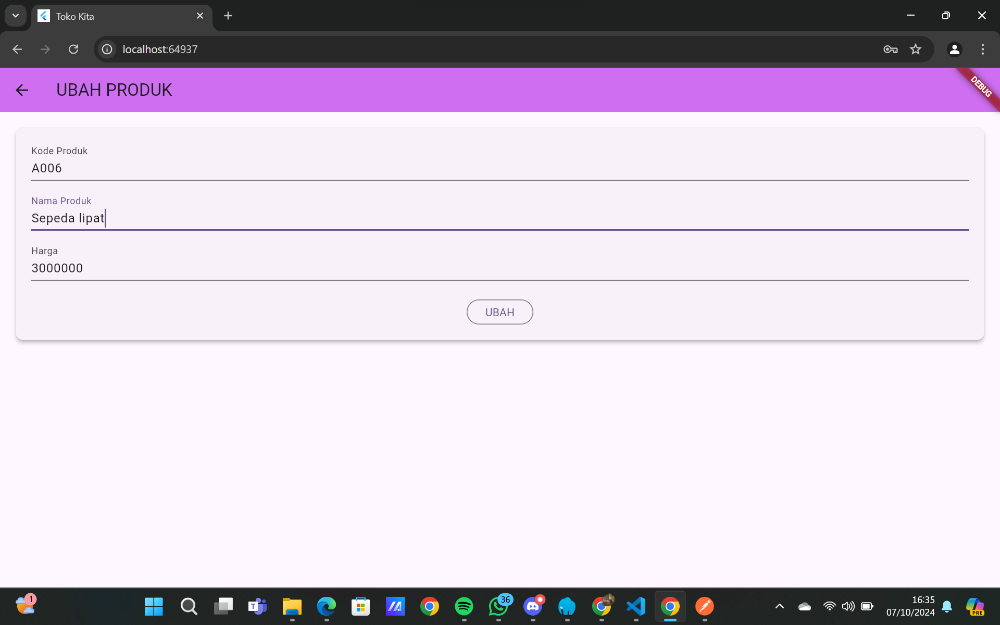
Ubah Produk: Jika produk sudah ada, fungsi ubah() akan dijalankan untuk memperbarui produk tersebut.

- Fungsi Simpan dan Ubah:
simpan(): Fungsi ini dipanggil ketika pengguna menambahkan produk baru. Data produk akan dikirimkan ke API melalui ProdukBloc.addProduk(). Jika berhasil, pengguna diarahkan ke halaman daftar produk (ProdukPage).
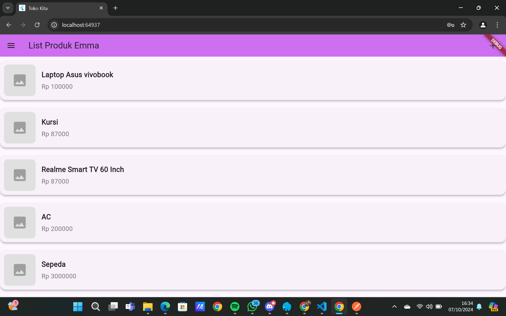
ubah(): Fungsi ini dipanggil untuk memperbarui produk yang sudah ada melalui ProdukBloc.updateProduk(). Jika berhasil, pengguna juga diarahkan kembali ke halaman daftar produk.
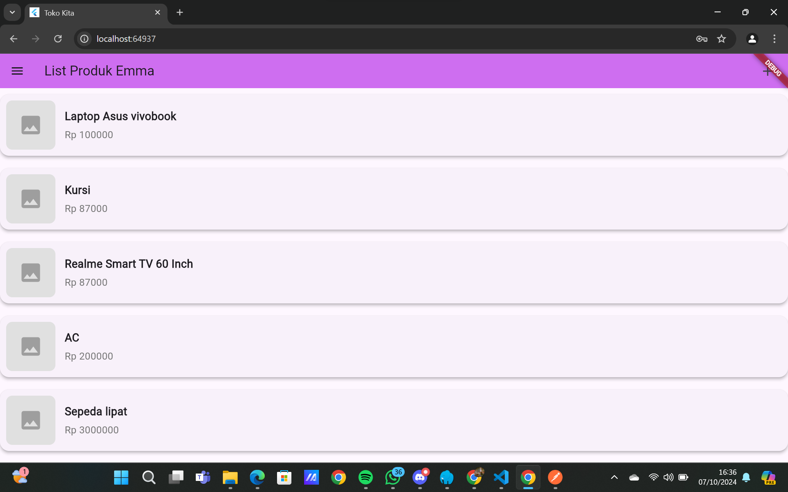

- Dialog Peringatan (Warning Dialog):
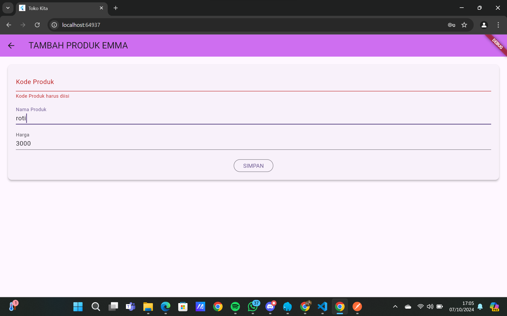
Jika terjadi kesalahan selama proses penyimpanan atau pengubahan (misalnya, jika ada masalah koneksi atau server), maka WarningDialog akan muncul untuk menampilkan pesan kesalahan. Ini memberikan umpan balik visual kepada pengguna jika ada kegagalan.
Navigator.of(context).push:

Setelah produk berhasil ditambahkan atau diubah, pengguna akan dialihkan kembali ke halaman ProdukPage yang berisi daftar produk melalui navigasi menggunakan Navigator.of(context).push().

4. Proses Delete
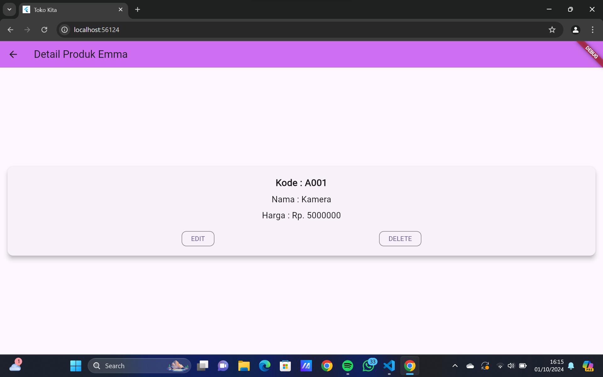
Bagian yang berhubungan dengan pop-up penghapusan produk terdapat di fungsi confirmHapus(). Berikut penjelasan singkat mengenai alur dari fungsi ini:

- Membuat Dialog Konfirmasi:
Sebuah AlertDialog dibuat dengan konten teks "Yakin ingin menghapus data ini?". Dialog ini menampilkan dua tombol: "Ya" dan "Batal".
Tombol "Ya" digunakan untuk mengonfirmasi penghapusan produk, sedangkan tombol "Batal" akan menutup dialog tanpa menghapus produk.

- Fungsi Tombol Hapus (Ya):
Saat tombol "Ya" ditekan, fungsi ini akan memanggil ProdukBloc.deleteProduk dengan parameter id dari produk yang ingin dihapus.
Jika penghapusan berhasil, pengguna akan diarahkan kembali ke halaman ProdukPage, yang berisi daftar produk.
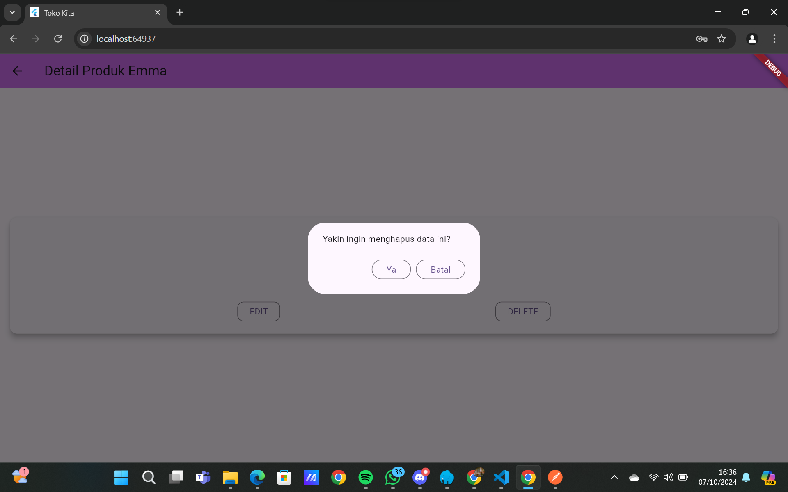
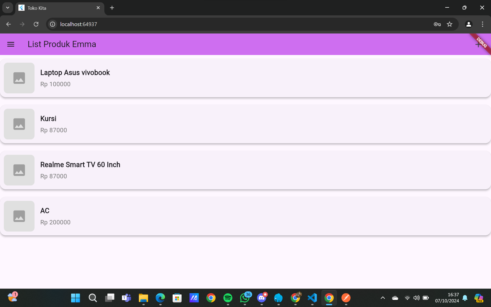
Jika terjadi kesalahan (misalnya, masalah koneksi atau error dari server), sebuah WarningDialog muncul untuk memberi tahu pengguna bahwa penghapusan gagal dengan pesan "Hapus gagal, silahkan coba lagi".

- Fungsi Tombol Batal:
Tombol ini hanya berfungsi untuk menutup dialog pop-up tanpa melakukan tindakan apa pun. Navigator.pop(context) digunakan untuk menutup dialog dan kembali ke halaman sebelumnya.

